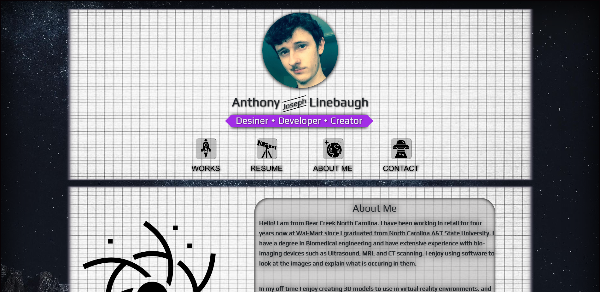

# Portfolio 

## Table of Contents

- [Installation](#installation)
- [Description](#description)
- [URLs](#urls)
- [Usage](#usage)
- [Images](#images)
- [Credits](#credits)
- [License](#license)
- [Contributions](#contributions)
- [Tests](#tests)
- [Questions](#questions)

## Installation

none!

## Description

A webpage dedicated to the works I have done and participated in with teams. In it, you will find my resume, contact info, previous works, and a bit of info about me!

## URLs

GitHub repository: https://github.com/ajlineb/UpDated_PortFolio

Webpage: https://ajlineb.github.io/UpDated_PortFolio/

## Usage

To showoff my skills!

## Images

## Credits

Icons made by <a href="https://www.flaticon.com/authors/maswan" title="maswan">maswan</a> from <a href="https://www.flaticon.com/" title="Flaticon">www.flaticon.com</a>

## License

MIT License

## Contributions

n/a

## Tests

n/a

## Questions

Contact by:  
GitHub Username: [ajlineb](https://github.com/ajlineb)  
Email: anthonylinebaugh95@gmail.com
